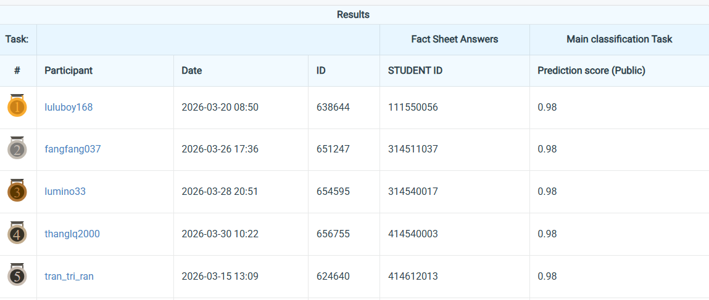

# NYCU Computer Vision - Spring 2025: Homework 1

**Student ID:** 414540003  
**Name:** Le Quang Thang

---

## 🎯 Objective
This project addresses the task of **fine-grained image classification** across 100 categories using a dataset of 21,024 samples. The problem is particularly challenging due to **high inter-class similarity**, where visually similar categories (e.g., different types of white flowers) require precise and discriminative feature learning.

---

## ⚙️ Constraints
To ensure fair comparison and practical deployment, the following constraints are enforced:

- No external datasets or additional data sources are allowed  
- Model size must be **less than 100 million parameters**  
- Backbone architectures are restricted to **ResNet variants** (e.g., ResNet18, ResNet34)  

---

## 🧠 Methodology
We adopt a comprehensive experimental strategy to tackle the challenges:

### 🔹 Backbone Exploration
- Evaluate multiple **ResNet-based architectures**
- Apply customized modifications to improve performance

### 🔹 Handling Class Imbalance
- Use **probability-based sampling strategies** to balance training data distribution

### 🔹 Data Augmentation
- Combine both:
  - **Weak augmentation** (e.g., flip, resize)
  - **Strong augmentation** (e.g., color jitter, random erasing)

### 🔹 Model Enhancement
- Integrate advanced modules:
  - **Attention mechanisms**
  - **Squeeze-and-Excitation (SE) blocks**
- Improve feature representation and channel-wise importance learning

### 🔹 Training Optimization
- Experiment with:
  - Different **batch sizes**
  - Various **learning rate schedulers**
  - Multiple **optimizers**

---

## ⚙️ Setup

Clone the repository and create the environment:

```bash
git clone https://github.com/thangle1109/Selected-Topics-in-Visual-Recognition-using-Deep-Learning-HW1.git
cd Selected_Topics_HW1
conda env create -f environment.yml
```

---
## 📁 Project Structure

```
HW1/
│
├── augmentation/        # Offline augmentation scripts (weak & strong)
├── data/                # Dataset: train/val/test folders
├── log_utils/           # Logging and monitoring utilities
├── utils/               # Helper functions
├── visualize/           # Visualization scripts
```

---

## 🚀 Training

Run one of the following training scripts:

```bash

# Baseline with SE module
python train.py

# Model with attention mechanism
python train_att.py

# Handle class imbalance with weighted sampling
python train_imbl.py

# Train with augmented data
CUDA_VISIBLE_DEVICES=0,1,2 python train_aug.py
#This is the best result on leaderboard
```

---

## 🧩 Appendix

### 🔄 Offline Augmentation

Apply data augmentation before training:

```bash
# Weak augmentation
python augmentation/weak.py

# Strong augmentation
python augmentation/strong.py
```

---

### 📊 Visualization

Generate training metrics and analysis:

```bash

# Plot training/validation loss & accuracy curves
python -m visualize.training_curve

# Draw confusion matrix
python -m custom.visualize.corre

# Count number of images per class
python -m visualize.num_class
```

---

### Performance Snapshot 
The submitted solution corresponds to the following entry on the leaderboard:

- **Participant:** thanglq2000  
- **Student ID:** 414540003  

